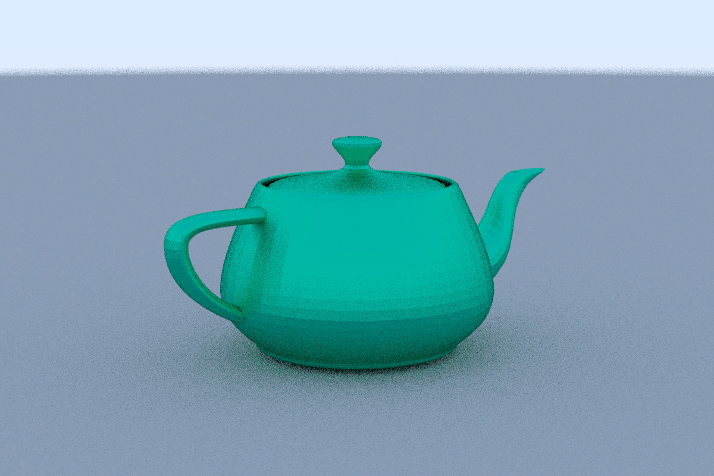
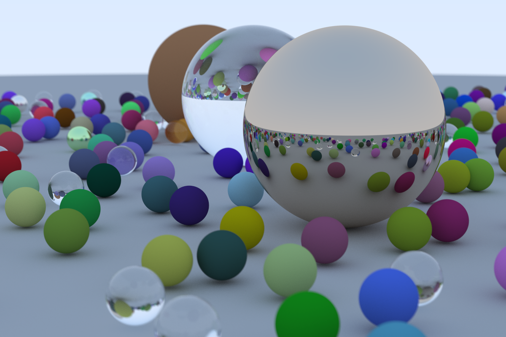

# Ray Tracer

A basic ray tracer that is based on [Ray Tracing in One Weekend](https://raytracing.github.io/books/RayTracingInOneWeekend.html)
but in Rust. Also includes .obj loading and uses Rayon to allow parallel execution of the program.

Here are some fancy images from the ray tracer:
  

  

## How to use

To run the program clone the repository then run `cargo run > file.ppm`.
