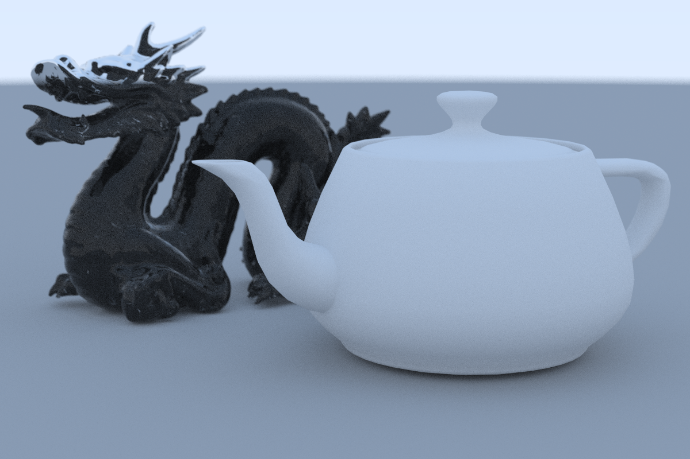

# Ray Tracer
# [Demo](https://rust-ray-tracer.netlify.app/)

*Rendered at 1280x1280 with 4096 samples/pixel in 01:19:34 on a Ryzen R7 2700x.*

## About

A basic ray tracer built in Rust that also runs on the web.

Some features include:
 * Parallel execution of ray tracing
 * .obj loading
 * BVH acceleration
 * Command line interface
 * Multiple image output formats

Here are some more images from the ray tracer:

  

## How to use

To run the program clone the repository then run `cargo run --release -- file.png` or use
`cargo run --release -- --help` to get more info on how to use the program.
